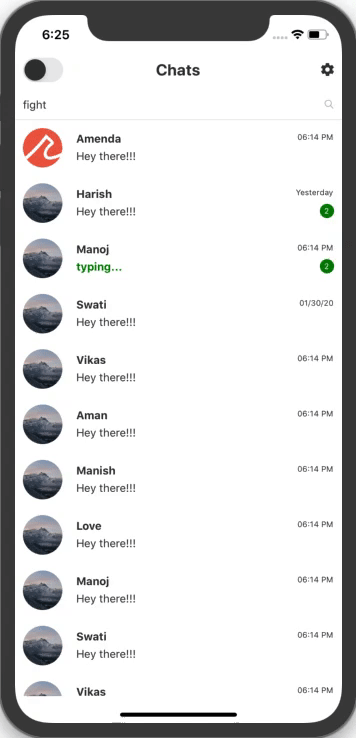
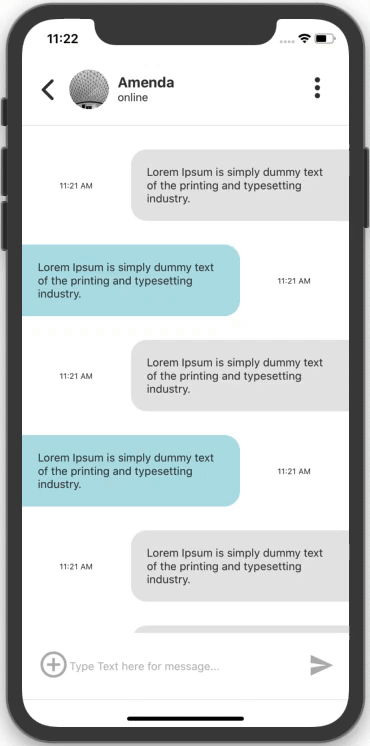
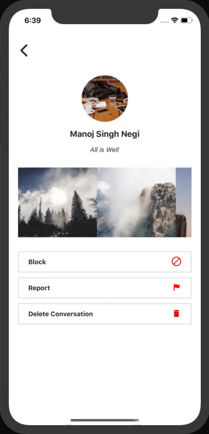
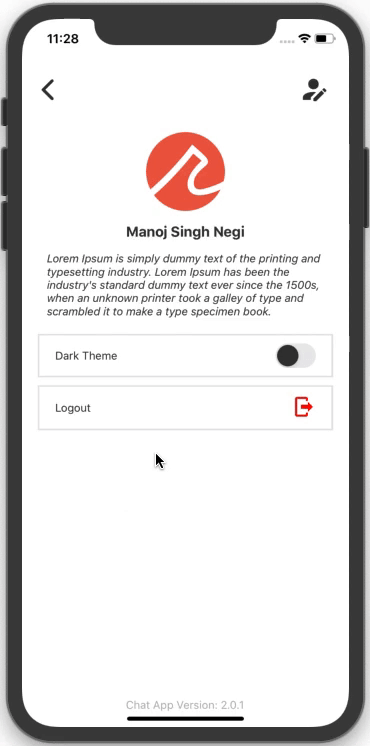
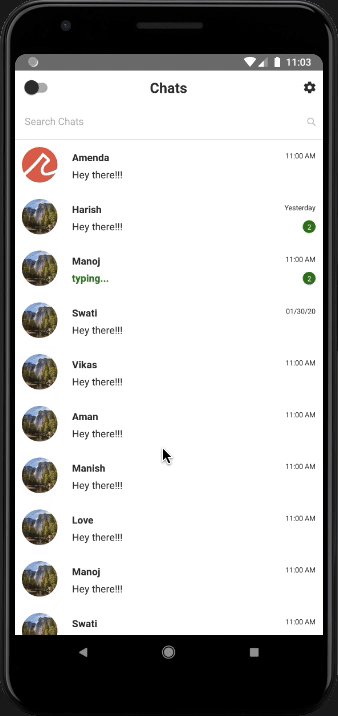
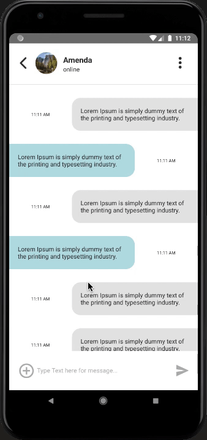
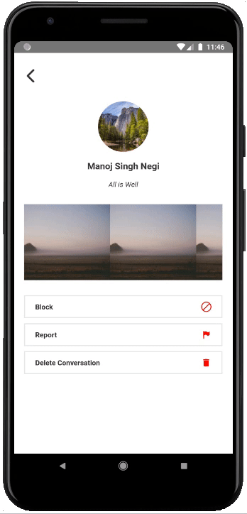
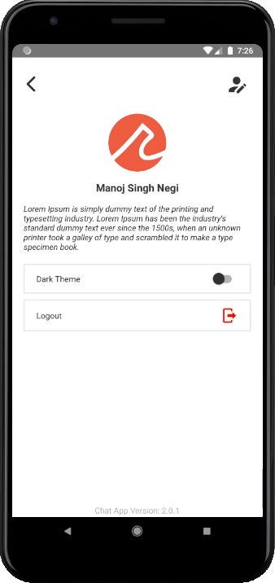

React native chat app boilerplate
=======

This chat app is a boilerplate for any react native developer who wants to build a chat app.

The goal of this boilerplate is to provide a fully functional chat app which can be reused with very little to no modification.

IOS Demo
=======
<p align="center">
  
</p>
<p align="left">
  
</p>

Android Demo
=======
<p align="center">
  
</p>
<p align="left">
  
</p>

Packages & Libraries used
=======

* [React Native](https://www.npmjs.com/package/react-native)
* [React](https://www.npmjs.com/package/react)
* [React router native](https://www.npmjs.com/package/react-router-native)
* [moment](https://www.npmjs.com/package/moment)
* [TypeScript](https://www.npmjs.com/package/typescript)
* [React Vector Icons](https://www.npmjs.com/package/react-native-vector-icons)

Steps to Run the Project in Development Mode
=======
Use the Below Commands to Clone the project and enter inside the Directory
After that Install the Dependencies.
```
git clone git@github.com:recraftrelic/react-native-chat-app-boilerplate.git
cd react-native-chat-app-boilerplate
yarn install
```

### IOS
We can directly run the app
```
npx react-native run-ios
```

### Facing any error related to pods in ios
We need to install the pods
```
sudo gem install cocoapods
cd ios
pod install
cd ..
npx react-native run-ios
```

### Android
We can directly run the app
```
npx react-native run-android
```

Contributors
=======
* [manojsinghnegiwd](https://github.com/manojsinghnegiwd) - Manoj Singh Negi
* [yashkapoor8710](https://github.com/yashkapoor8710) - Yogesh Kapoor

Sponsors
=======
[](http://www.recraftrelic.com)